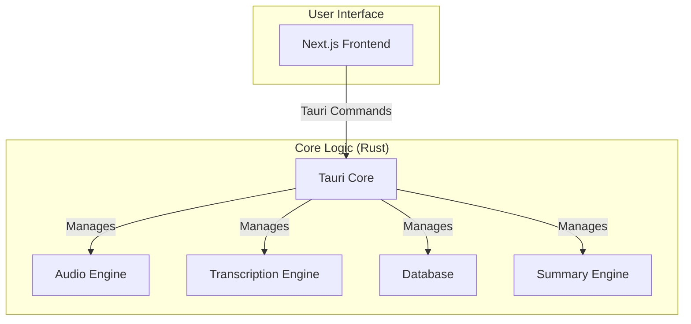
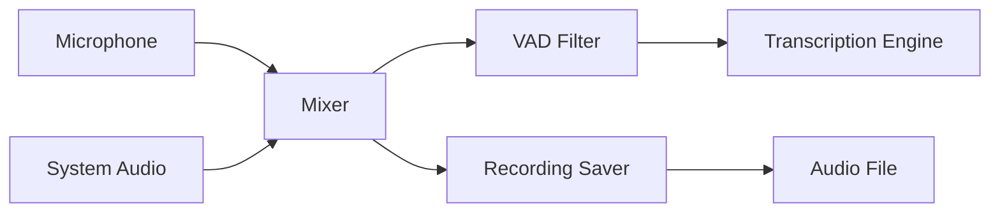
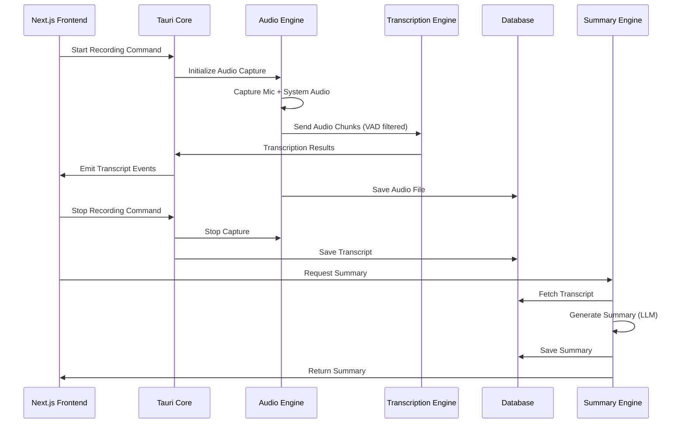

# System Architecture

Meetily is a self-contained desktop application built with [Tauri](https://tauri.app/). It combines a Rust-based backend with a Next.js frontend into a single, efficient, and cross-platform application.

## High-Level Overview

Meetily follows a three-tier architecture that keeps all processing local:



## Component Architecture

The application consists of two main parts working together:

### Frontend (Next.js)

The user interface layer that provides:

- Meeting management interface
- Real-time transcription display
- Recording controls
- Settings and configuration
- Meeting summaries and exports

**Technology Stack:**
- Next.js 14
- React 18
- TypeScript
- Tailwind CSS

**Communication:**
- Communicates with Rust core via Tauri's command system
- Receives real-time updates through Tauri events
- WebSocket connections for live transcription updates

### Backend (Rust Core)

The core application logic written in Rust for performance and safety:

<AccordionGroup>

<Accordion title="Tauri Core" icon="window">

The heart of the application that:
- Manages application windows and lifecycle
- Handles event dispatching
- Exposes Rust functionality to the frontend
- Provides IPC (Inter-Process Communication) bridge

**Key Files:**
- `frontend/src-tauri/src/lib.rs` - Main entry point and command registration
- `frontend/src-tauri/src/main.rs` - Application initialization

</Accordion>

<Accordion title="Audio Engine" icon="microphone">

Handles all audio capture and processing:

**Features:**
- Dual-channel recording (microphone + system audio)
- Professional audio mixing with RMS-based ducking
- Voice Activity Detection (VAD) filtering
- Real-time audio level monitoring
- Cross-platform audio capture:
  - **macOS**: ScreenCaptureKit (system audio)
  - **Windows**: WASAPI (loopback)
  - **Linux**: ALSA/PulseAudio

**Key Components:**
- `audio/devices/` - Device discovery and configuration
- `audio/capture/` - Audio stream capture
- `audio/pipeline.rs` - Audio mixing and VAD processing
- `audio/recording_manager.rs` - High-level recording coordination

**Audio Pipeline:**



</Accordion>

<Accordion title="Transcription Engine" icon="message">

Provides speech-to-text capabilities using local AI models:

**Supported Models:**
- Whisper (tiny, base, small, medium, large)
- GPU-accelerated processing:
  - **macOS**: Metal + CoreML
  - **NVIDIA**: CUDA
  - **AMD/Intel**: Vulkan
  - **Fallback**: CPU-only

**Features:**
- Real-time transcription during recording
- Batch transcription for existing audio
- Speaker diarization support
- Timestamp synchronization
- Multiple language support

**Key Files:**
- `whisper_engine/whisper_engine.rs` - Model management
- `whisper_engine/parallel_processor.rs` - Batch processing

**Performance:**
- VAD filtering reduces processing load by ~70%
- GPU acceleration provides 5-10x speedup
- Efficient ring buffer for continuous audio

</Accordion>

<Accordion title="Database" icon="database">

Local SQLite database for data persistence:

**Stored Data:**
- Meeting metadata (name, date, duration)
- Transcriptions with timestamps
- Meeting summaries
- User settings and preferences
- Audio file references

**Technology:**
- SQLite for lightweight local storage
- Async operations with `aiosqlite`
- Automatic backups and migrations

**Storage Locations:**
- **macOS**: `~/Library/Application Support/Meetily/`
- **Windows**: `%APPDATA%\Meetily\`
- **Linux**: `~/.local/share/Meetily/`

</Accordion>

<Accordion title="Summary Engine" icon="sparkles">

Generates intelligent meeting summaries using LLMs:

**Supported Providers:**
- **Ollama** (local, privacy-first)
- **Claude** (Anthropic)
- **Groq** (fast inference)
- **OpenRouter** (multiple models)

**Features:**
- Automatic summary generation
- Key points extraction
- Action items identification
- Custom summary templates
- Multi-language support

**Backend API:**
- FastAPI server (port 5167)
- RESTful endpoints for summary generation
- Streaming responses for real-time updates

</Accordion>

</AccordionGroup>

## Data Flow

Here's how data flows through the system during a typical recording:



## Communication Patterns

### Tauri Commands (Frontend → Rust)

The frontend invokes Rust functions using Tauri commands:

```typescript
// Frontend: src/app/page.tsx
import { invoke } from '@tauri-apps/api/core';

await invoke('start_recording', {
  mic_device_name: "Built-in Microphone",
  system_device_name: "BlackHole 2ch",
  meeting_name: "Team Standup"
});
```

```rust
// Rust: src/lib.rs
#[tauri::command]
async fn start_recording(
    mic_device_name: Option<String>,
    system_device_name: Option<String>,
    meeting_name: Option<String>
) -> Result<(), String> {
    // Implementation
}
```

### Tauri Events (Rust → Frontend)

The Rust core emits events that the frontend listens to:

```rust
// Rust: Emit transcript updates
app.emit("transcript-update", TranscriptUpdate {
    text: "Hello world".to_string(),
    timestamp: chrono::Utc::now(),
})?;
```

```typescript
// Frontend: Listen for events
import { listen } from '@tauri-apps/api/event';

await listen<TranscriptUpdate>('transcript-update', (event) => {
  setTranscripts(prev => [...prev, event.payload]);
});
```

## Audio Processing Pipeline

The audio system is one of Meetily's most sophisticated components:

### Dual-Path Architecture

Meetily processes audio through two parallel paths:

```
Raw Audio (Mic + System)
         ↓
┌────────────────────────────────────────────────────────┐
│              Audio Pipeline Manager                     │
└─────────────┬──────────────────────┬───────────────────┘
              ↓                      ↓
    ┌─────────────────┐    ┌─────────────────────┐
    │ Recording Path  │    │ Transcription Path  │
    │ (Pre-mixed)     │    │ (VAD-filtered)      │
    └─────────────────┘    └─────────────────────┘
              ↓                      ↓
    RecordingSaver.save()  WhisperEngine.transcribe()
```

**Recording Path:**
- Professional audio mixing
- RMS-based ducking (prevents system audio from drowning out microphone)
- Clipping prevention
- Saves high-quality audio file

**Transcription Path:**
- Voice Activity Detection (VAD) filters out silence
- Reduces Whisper processing load by ~70%
- Only processes segments with speech
- Real-time transcription

### Ring Buffer Mixing

Handles asynchronous audio streams:

- Microphone and system audio arrive at different rates
- Ring buffer accumulates samples until both streams align
- Processes 50ms windows for low-latency mixing
- Uses `VecDeque` for efficient windowed operations

## Model Management

### Model Storage

**Development:**
- `frontend/models/`
- `backend/whisper-server-package/models/`

**Production:**
- **macOS**: `~/Library/Application Support/Meetily/models/`
- **Windows**: `%APPDATA%\Meetily\models\`
- **Linux**: `~/.local/share/Meetily/models/`

### GPU Acceleration

Automatic detection and configuration:

| Platform | Acceleration | Detection |
|----------|--------------|----------|
| macOS | Metal + CoreML | Automatic |
| Windows (NVIDIA) | CUDA | Auto-detect toolkit |
| Windows (AMD/Intel) | Vulkan | Auto-detect SDK |
| Linux (NVIDIA) | CUDA | Auto-detect toolkit |
| Linux (AMD) | ROCm/HIPBlas | Auto-detect toolkit |
| Linux (Other) | Vulkan | Auto-detect SDK |
| Fallback | CPU-only | Always available |

## Performance Optimizations

### Audio Processing

- **Conditional Logging**: `perf_debug!()` and `perf_trace!()` macros compile to zero overhead in release builds
- **Buffer Pooling**: Pre-allocated audio buffers reduce allocation overhead
- **VAD Filtering**: Reduces transcription load by 70%
- **Batched Metrics**: Audio metrics batched to reduce event emissions

### Transcription

- **Model Caching**: Models loaded once and kept in memory
- **Parallel Processing**: Batch transcription uses parallel workers
- **GPU Offloading**: 5-10x faster than CPU-only processing
- **Streaming Results**: Real-time transcription as audio is captured

### Frontend

- **State Batching**: React state updates batched via context
- **Virtual Scrolling**: Efficient rendering of large transcript lists
- **Throttled Updates**: Audio level monitoring limited to 60fps
- **Event Debouncing**: Reduces unnecessary re-renders

## Platform-Specific Considerations

### macOS

- **System Audio**: Requires ScreenCaptureKit (macOS 13+)
- **Permissions**: Needs microphone + screen recording permissions
- **Virtual Device**: BlackHole or similar for system audio capture
- **GPU**: Metal acceleration automatic

### Windows

- **System Audio**: WASAPI loopback (built-in)
- **Build Tools**: Requires Visual Studio C++ workload
- **GPU**: Manual SDK installation (CUDA/Vulkan)
- **Permissions**: Microphone permission only

### Linux

- **System Audio**: ALSA/PulseAudio
- **GPU**: Multiple options (CUDA/ROCm/Vulkan)
- **Dependencies**: Requires cmake, llvm, libomp
- **Permissions**: Microphone access

## Security and Privacy

Meetily is designed with privacy as a core principle:

- ✅ **All processing local** - No cloud services required
- ✅ **Offline-capable** - Works completely offline
- ✅ **Data ownership** - You control all data
- ✅ **No telemetry** - No usage tracking
- ✅ **Open source** - Auditable codebase

<Info>
  When using cloud LLM providers for summaries, only the transcript text is sent (never audio). You can use Ollama for completely local processing.
</Info>

## Next Steps

<CardGroup cols={2}>

<Card title="Building from Source" icon="hammer" href="/advanced/building-from-source">
  Learn how to build Meetily on your platform
</Card>

<Card title="Contributing" icon="code-pull-request" href="/advanced/contributing">
  Contribute to the Meetily project
</Card>

</CardGroup>