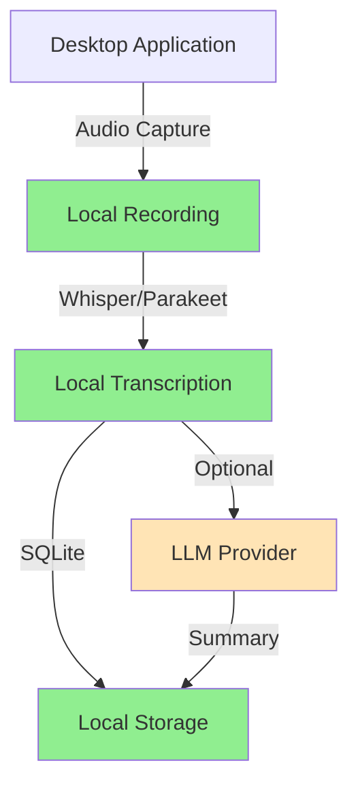

# Introduction to Meetily

Meetily is a privacy-first AI meeting assistant that runs entirely on your local machine. It captures your meetings, transcribes them in real-time, and generates summaries—all without sending any data to the cloud. Built by expert AI engineers passionate about data sovereignty, Meetily is the perfect solution for professionals and enterprises who need to maintain complete control over their sensitive information.

<CardGroup cols={2}>
  <Card title="100% Local Processing" icon="lock">
    All transcription and AI processing happens on your device. Your meeting data never leaves your infrastructure.
  </Card>
  <Card title="Open Source" icon="code">
    MIT licensed and fully transparent. Review, modify, and deploy on your own terms.
  </Card>
  <Card title="Multi-Platform" icon="desktop">
    Works seamlessly on macOS, Windows, and Linux with native performance.
  </Card>
  <Card title="GPU Accelerated" icon="rocket">
    Built-in support for Metal, CUDA, and Vulkan for lightning-fast transcription.
  </Card>
</CardGroup>

## What is Meetily?

Meetily is a self-contained desktop application built with [Tauri](https://tauri.app/) that combines a Rust-based backend with a Next.js frontend into a single, efficient, and cross-platform application. It provides:

- **Real-time transcription** using Whisper or Parakeet models running locally
- **AI-powered summaries** with support for local LLMs (Ollama) or cloud providers
- **Professional audio mixing** that captures both microphone and system audio
- **Complete data ownership** with local SQLite storage
- **Enterprise-ready features** including import/export, custom templates, and more

<Note>
  **Privacy by Design**: Meetily was built from the ground up with privacy as the core principle. Unlike cloud-based alternatives, your sensitive conversations never touch external servers unless you explicitly choose to use a cloud LLM provider for summaries.
</Note>

## Key Features

### Local-First Transcription

Transcribe meetings entirely on your device using state-of-the-art speech recognition models:

- **Whisper models**: Choose from `tiny`, `base`, `small`, `medium`, or `large-v3` depending on your accuracy needs
- **Parakeet models**: NVIDIA's Parakeet TDT for enhanced performance
- **GPU acceleration**: Automatic hardware detection for Metal (Apple Silicon), CUDA (NVIDIA), or Vulkan (AMD/Intel)
- **Voice Activity Detection (VAD)**: Intelligent filtering that reduces processing load by ~70%

<Tabs>
  <Tab title="macOS">
    **Metal + CoreML** acceleration is automatically enabled on Apple Silicon and modern Intel Macs.
    
    ```bash
    # Models stored at:
    ~/Library/Application Support/Meetily/models/
    ```
  </Tab>
  <Tab title="Windows">
    **CUDA** (NVIDIA) or **Vulkan** (AMD/Intel) acceleration available through feature flags.
    
    ```powershell
    # Models stored at:
    %APPDATA%\Meetily\models\
    ```
  </Tab>
  <Tab title="Linux">
    **CUDA**, **Vulkan**, or **OpenBLAS** acceleration with automatic GPU detection.
    
    ```bash
    # Build with GPU acceleration
    ./build-gpu.sh
    ```
  </Tab>
</Tabs>

### AI-Powered Summaries

Generate structured meeting summaries with your choice of AI provider:

<CardGroup cols={2}>
  <Card title="Ollama (Recommended)" icon="server">
    Run models locally with zero latency and complete privacy. Supports Llama, Qwen, Mistral, and more.
  </Card>
  <Card title="Cloud Providers" icon="cloud">
    Optional integration with Anthropic Claude, Groq, OpenRouter, or any OpenAI-compatible endpoint.
  </Card>
</CardGroup>

Summary output includes:
- Section summaries with key discussion points
- Critical deadlines extraction
- Key items and decisions
- Immediate action items with assignees
- Next steps and follow-ups
- Other important points
- Closing remarks

### Professional Audio Capture

Meetily's advanced audio pipeline provides studio-quality recording:

- **Dual-stream capture**: Simultaneous microphone and system audio
- **RMS-based ducking**: Automatically balances system audio to prevent drowning out voices
- **Clipping prevention**: Professional mixing ensures clean recordings
- **Cross-platform support**:
  - macOS: ScreenCaptureKit (macOS 13+)
  - Windows: WASAPI loopback
  - Linux: ALSA/PulseAudio

<Warning>
  **macOS System Audio**: Requires a virtual audio device like [BlackHole](https://existential.audio/blackhole/) to capture system audio. Microphone permissions and screen recording permissions are required.
</Warning>

## Privacy-First Architecture

Meetily's architecture ensures complete data sovereignty:



<Steps>
  <Step title="Audio Capture">
    Audio is captured using native OS APIs and stored directly to disk in your chosen format.
  </Step>
  <Step title="Transcription">
    Whisper or Parakeet models run locally with GPU acceleration, processing audio in real-time.
  </Step>
  <Step title="Storage">
    All transcripts, recordings, and metadata are stored in a local SQLite database.
  </Step>
  <Step title="Summarization">
    Optionally send transcripts to your chosen LLM provider (local or cloud) for structured summaries.
  </Step>
</Steps>

### What Data Stays Local?

✅ **Always Local:**
- Audio recordings (microphone and system audio)
- Transcription models (Whisper/Parakeet)
- Complete meeting transcripts
- Meeting metadata and notes
- All user settings and configurations

⚠️ **Optional Cloud Processing:**
- AI summaries (only if using cloud LLM providers like Claude or Groq)
- Anonymous usage analytics (can be disabled)

❌ **Never Collected:**
- Meeting content or transcripts for analytics
- Personal information or identifiable data
- File names, meeting titles, or participant names
- Audio data or voice patterns

## Use Cases

Meetily is trusted by professionals across sensitive industries:

<AccordionGroup>
  <Accordion title="Enterprise & Business" icon="building">
    - **Board meetings** with confidential strategic discussions
    - **Product planning** sessions with proprietary roadmaps
    - **M&A discussions** requiring strict confidentiality
    - **Executive briefings** with sensitive financial data
    - **HR interviews** with candidate privacy requirements
    
    **Why Meetily?** Complete control over data prevents leaks, ensures compliance, and eliminates vendor risk.
  </Accordion>
  
  <Accordion title="Legal & Compliance" icon="gavel">
    - **Client consultations** with attorney-client privilege
    - **Depositions** requiring strict chain of custody
    - **Contract negotiations** with confidential terms
    - **Compliance reviews** for GDPR, HIPAA, or SOC 2
    - **Internal investigations** with sensitive testimony
    
    **Why Meetily?** Local processing ensures privilege protection and regulatory compliance without compromise.
  </Accordion>
  
  <Accordion title="Healthcare & Research" icon="hospital">
    - **Patient consultations** subject to HIPAA
    - **Clinical research** with confidential trial data
    - **Peer review sessions** with unpublished findings
    - **Telemedicine appointments** requiring PHI protection
    - **Grand rounds** with case discussions
    
    **Why Meetily?** HIPAA-compliant local processing eliminates Business Associate Agreement complexity.
  </Accordion>
  
  <Accordion title="Defense & Government" icon="shield">
    - **Classified briefings** (unclassified environments)
    - **Contract discussions** with sensitive specifications
    - **Program reviews** with controlled information
    - **Policy development** with pre-publication content
    - **Audit preparations** with confidential findings
    
    **Why Meetily?** Air-gapped operation possible; no data transmission to third-party infrastructure.
  </Accordion>
  
  <Accordion title="Education & Academia" icon="graduation-cap">
    - **Lecture capture** for students
    - **Faculty meetings** with confidential personnel matters
    - **Research group meetings** with unpublished data
    - **Thesis defense** recordings
    - **Student counseling** sessions
    
    **Why Meetily?** Affordable local processing vs. expensive cloud transcription services.
  </Accordion>
</AccordionGroup>

## How It Works

<Steps>
  <Step title="Install Meetily">
    Download the native application for macOS, Windows, or Linux. No accounts or cloud setup required.
  </Step>
  
  <Step title="Configure Audio Devices">
    Select your microphone and optionally enable system audio capture for complete meeting context.
  </Step>
  
  <Step title="Choose Your AI Stack">
    Select a transcription model (Whisper or Parakeet) and optionally configure an LLM provider for summaries.
  </Step>
  
  <Step title="Start Recording">
    Click record and Meetily captures, transcribes, and optionally summarizes in real-time.
  </Step>
  
  <Step title="Review & Export">
    Access your transcripts and summaries instantly. Export to markdown, text, or enhanced formats (PRO).
  </Step>
</Steps>

<Info>
  **First-time setup**: Meetily will download your selected Whisper model on first use. The `base` model (~140MB) is recommended for development, while `medium` or `large-v3` provide the best accuracy for production use.
</Info>

## Performance Benchmarks

With GPU acceleration, Meetily provides real-time or faster transcription:

| Hardware | Model | Speed | Use Case |
|----------|-------|-------|----------|
| Apple M1 | small | 15x realtime | Development |
| Apple M1 | medium | 8x realtime | Production |
| RTX 3080 | small | 20x realtime | Development |
| RTX 3080 | large-v3 | 10x realtime | Best quality |
| CPU only | base | 2x realtime | Minimum viable |

<Tip>
  **Optimal Configuration**: For the best balance of accuracy and performance, use the `medium` model with GPU acceleration. This provides professional-grade transcription at 5-10x realtime speed.
</Tip>

## Open Source & Community

Meetily is MIT licensed and built in the open:

- **GitHub Repository**: Full source code with detailed documentation
- **Active Development**: Regular updates with community-driven features
- **No Vendor Lock-in**: Fork, modify, and deploy on your own infrastructure
- **Community Support**: Discord community for questions and discussions

<CardGroup cols={2}>
  <Card title="GitHub Repository" icon="github" href="https://github.com/Zackriya-Solutions/meeting-minutes">
    Star the project and contribute
  </Card>
  <Card title="Join Discord" icon="discord" href="https://discord.gg/crRymMQBFH">
    Get help and share feedback
  </Card>
</CardGroup>

## Next Steps

<CardGroup cols={2}>
  <Card title="Why Meetily?" icon="question" href="/why-meetily">
    Learn about privacy risks and cost comparisons
  </Card>
  <Card title="Quick Start" icon="rocket" href="/quickstart/first-recording">
    Install and configure Meetily in 5 minutes
  </Card>
  <Card title="Architecture" icon="diagram-project" href="/advanced/architecture">
    Deep dive into system design
  </Card>
  <Card title="API Reference" icon="code" href="/api-reference">
    Integrate with Meetily's API
  </Card>
</CardGroup>