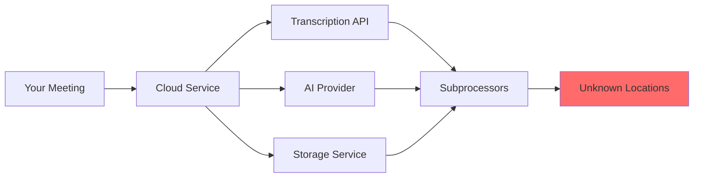

# Why Choose Meetily?

While cloud-based meeting transcription tools offer convenience, they create significant privacy, compliance, and cost challenges. Meetily solves these problems by processing everything locally on your infrastructure.

## The Privacy Problem

Meeting AI tools create substantial risks across all sectors:

<CardGroup cols={3}>
  <Card title="$4.4M" icon="money-bill-wave">
    Average cost per data breach (IBM 2024)
  </Card>
  <Card title="€5.88B" icon="gavel">
    GDPR fines issued by 2025
  </Card>
  <Card title="400+" icon="scale-balanced">
    Unlawful recording cases in California (2024)
  </Card>
</CardGroup>

### What Happens to Your Meeting Data?

When you use cloud meeting tools, your data flows through multiple third parties:



<Warning>
  **Critical Issue**: Most cloud services disclose that your data may be processed by subprocessors in undisclosed locations, making true compliance nearly impossible to verify.
</Warning>

### Real Risks for Your Organization

<AccordionGroup>
  <Accordion title="1. Regulatory Compliance Violations" icon="clipboard-check">
    **The Problem**: Cloud services often cannot guarantee where data is processed.
    
    **Regulations at Risk:**
    - **GDPR** (Europe): Requires data processing records and explicit cross-border transfer mechanisms
    - **HIPAA** (Healthcare): Mandates Business Associate Agreements (BAAs) with all processors
    - **CCPA** (California): Grants consumers rights that cloud subprocessors may not honor
    - **SOC 2**: Requires complete audit trails that cloud chains obscure
    - **ITAR** (Defense): Prohibits foreign national access to controlled information
    
    **Meetily's Solution**: 100% local processing means you control the entire compliance chain. No subprocessors, no cross-border transfers, no BAA complexity.
  </Accordion>
  
  <Accordion title="2. Data Breach Exposure" icon="shield-halved">
    **The Problem**: Cloud services are high-value targets for attackers.
    
    **Recent Examples:**
    - **2023**: Major transcription service exposed 4M+ audio files
    - **2024**: AI company breach leaked customer conversations
    - **Ongoing**: Nation-state actors targeting SaaS credentials
    
    **Attack Vectors:**
    - Compromised employee credentials
    - API vulnerabilities
    - Misconfigured storage buckets
    - Third-party vendor breaches
    - Supply chain attacks
    
    **Meetily's Solution**: Your data never leaves your infrastructure. No cloud account means no cloud breach exposure.
  </Accordion>
  
  <Accordion title="3. Legal Privilege Risks" icon="gavel">
    **The Problem**: Attorney-client privilege may be waived if conversations are shared with third parties.
    
    **Why It Matters:**
    - Cloud transcription services may not qualify as agent of the attorney
    - Subprocessor access could constitute third-party disclosure
    - Discovery requests may force disclosure of cloud-stored content
    - Privilege logs become complex with unknown processors
    
    **Case Risk**: Opposing counsel arguing privilege waiver because meeting content was processed by commercial AI services.
    
    **Meetily's Solution**: Local processing ensures no third-party disclosure. Attorney controls entire processing chain.
  </Accordion>
  
  <Accordion title="4. Competitive Intelligence Leaks" icon="user-secret">
    **The Problem**: AI training and service improvement clauses may expose your strategy.
    
    **Hidden Risks:**
    - Many ToS allow "service improvement" using customer data
    - AI models may inadvertently memorize sensitive content
    - Employees of cloud providers have potential access
    - Aggregated insights could benefit competitors
    - M&A due diligence reveals cloud service dependencies
    
    **What's at Risk:**
    - Product roadmaps and launch strategies
    - Pricing negotiations and cost structures
    - Customer acquisition strategies
    - Vulnerability disclosures
    - Organizational restructuring plans
    
    **Meetily's Solution**: Your competitive intelligence stays on your devices. No risk of inadvertent disclosure through AI training or employee access.
  </Accordion>
</AccordionGroup>

## Cost Comparison

Cloud meeting services charge per minute or seat, creating unpredictable costs that scale with usage:

### Enterprise Cost Analysis (100 users, 20 meetings/week)

<Tabs>
  <Tab title="Cloud Services">
    **Typical Cloud Pricing** (per user/month):
    - **Basic Transcription**: $20-30/user
    - **AI Summaries**: +$10-20/user
    - **Recording Storage**: +$5-10/user
    - **API Access**: +$15/user
    
    **Annual Cost for 100 Users:**
    ```
    Base: $30/user × 100 users × 12 months = $36,000
    Summaries: $15/user × 100 users × 12 months = $18,000
    Storage: $8/user × 100 users × 12 months = $9,600
    API: $15/user × 100 users × 12 months = $18,000
    
    Total: $81,600/year
    ```
    
    **Hidden Costs:**
    - Compliance overhead (legal review, BAAs)
    - Data egress fees for exports
    - Per-minute overages
    - Seat-based scaling (costs grow linearly)
  </Tab>
  
  <Tab title="Meetily Community">
    **One-Time Costs:**
    - Software: **$0** (open source, MIT licensed)
    - Hardware: Use existing infrastructure
    
    **Ongoing Costs:**
    - Maintenance: Minimal (self-contained application)
    - Updates: Free community releases
    - Support: Community Discord & GitHub
    
    **Annual Cost for 100 Users:**
    ```
    License: $0
    Infrastructure: $0 (runs on user devices)
    Support: $0 (community)
    
    Total: $0/year
    ```
    
    **5-Year TCO Savings: $408,000**
  </Tab>
  
  <Tab title="Meetily PRO">
    **One-Time or Annual License:**
    - **Individual**: $99/year (enhanced accuracy, templates, exports)
    - **Teams (2-100 users)**: Custom pricing for self-hosted deployment
    - **Enterprise (100+)**: Volume discounts + managed compliance
    
    **Example: 100-user Team**
    ```
    Estimated: ~$3,000-6,000/year
    (vs. $81,600/year for cloud services)
    
    Annual Savings: ~$75,000
    5-Year TCO Savings: ~$375,000
    ```
    
    **Additional PRO Benefits:**
    - Enhanced transcription models
    - Custom summary templates
    - Advanced exports (PDF, DOCX)
    - Auto-meeting detection
    - Priority support
    - GDPR compliance built-in
  </Tab>
</Tabs>

<Info>
  **Cost Scaling**: Cloud services cost more as you grow. Meetily Community costs stay at **$0** regardless of scale. Meetily PRO costs scale minimally with volume discounts.
</Info>

## Data Sovereignty & Compliance

Meetily's local-first architecture provides complete data sovereignty:

### Compliance Made Simple

<Steps>
  <Step title="Data Processing Records">
    **GDPR Article 30**: Maintain records of processing activities.
    
    **With Cloud Services:** Complex multi-processor documentation required.
    
    **With Meetily:** Single-entry record: "Local processing on user device."
  </Step>
  
  <Step title="Data Transfer Mechanisms">
    **GDPR Chapter V**: Requires mechanisms for international transfers.
    
    **With Cloud Services:** Need Standard Contractual Clauses (SCCs) or Adequacy Decisions.
    
    **With Meetily:** No international transfers = no transfer mechanisms required.
  </Step>
  
  <Step title="Data Subject Rights">
    **GDPR Articles 15-22**: Right to access, rectification, erasure, etc.
    
    **With Cloud Services:** Must coordinate with all subprocessors for complete response.
    
    **With Meetily:** Direct file system access = immediate, complete response.
  </Step>
  
  <Step title="Data Breach Notification">
    **GDPR Article 33**: 72-hour breach notification requirement.
    
    **With Cloud Services:** Dependent on cloud provider detection and notification.
    
    **With Meetily:** You control detection and response. No waiting for third-party notification.
  </Step>
</Steps>

### GDPR Compliance Checklist

| Requirement | Cloud Services | Meetily |
|-------------|----------------|----------|
| **Data Processing Agreement** | Required with provider + subprocessors | Not required (no processor) |
| **International Transfer Safeguards** | SCCs or Adequacy Decision | Not applicable (no transfers) |
| **Processor List Maintenance** | Must track all subprocessors | Not applicable (no processor) |
| **Data Subject Access Requests** | Complex multi-party coordination | Direct file access |
| **Right to Erasure** | Depend on provider compliance | Delete local files |
| **Data Breach Notification** | Waiting for provider notification | Immediate internal control |
| **Data Protection Impact Assessment** | Complex due to multiple processors | Simplified (single system) |

<Tip>
  **Audit Advantage**: During regulatory audits, demonstrating compliance with local-only processing is dramatically simpler than documenting complex cloud processor chains.
</Tip>

### HIPAA Compliance

For healthcare organizations subject to HIPAA:

<CardGroup cols={2}>
  <Card title="Cloud Services" icon="cloud">
    **Requirements:**
    - Business Associate Agreement (BAA) with primary vendor
    - BAAs with all subprocessors
    - Continuous monitoring of processor compliance
    - Risk analysis of entire processing chain
    - Breach notification procedures across multiple entities
    
    **Challenges:**
    - Subprocessors may refuse BAAs
    - International processors complicate compliance
    - Limited visibility into processor practices
    - Shared responsibility model creates gaps
  </Card>
  
  <Card title="Meetily" icon="hospital">
    **Requirements:**
    - Standard device encryption (already required for PHI devices)
    - Access controls (OS-level user permissions)
    - Local audit logging
    
    **Advantages:**
    - No BAAs required (no business associates)
    - Complete control over technical safeguards
    - Simplified risk analysis
    - Clear security boundaries
    - No shared responsibility complexity
  </Card>
</CardGroup>

## Comparison with Alternatives

### Meetily vs. Cloud Transcription Services

| Feature | Meetily | Otter.ai | Fireflies | Grain |
|---------|---------|----------|-----------|-------|
| **Privacy** | 100% local | Cloud | Cloud | Cloud |
| **Data Location** | Your device | Unknown | Unknown | Unknown |
| **Internet Required** | No* | Yes | Yes | Yes |
| **Cost (100 users/year)** | $0-6K | ~$80K | ~$75K | ~$70K |
| **GDPR Compliant** | Yes (simple) | Complex | Complex | Complex |
| **HIPAA Capable** | Yes | BAA required | BAA required | BAA required |
| **Open Source** | Yes (MIT) | No | No | No |
| **Vendor Lock-in** | None | High | High | High |
| **Custom Deployment** | Full control | No | Limited | No |
| **API Access** | Full local API | Paid tier | Paid tier | Paid tier |

<Note>
  *Meetily can run completely offline when using local AI models (Ollama). Internet is only required if you choose to use cloud LLM providers for summaries.
</Note>

### Meetily vs. Traditional Recording Solutions

| Feature | Meetily | Manual Recording | Zoom Cloud |
|---------|---------|------------------|------------|
| **Real-time Transcription** | ✅ Yes | ❌ No | ✅ Yes |
| **AI Summaries** | ✅ Yes | ❌ No | ⚠️ Limited |
| **Local Storage** | ✅ Yes | ✅ Yes | ❌ No |
| **Cost** | $0 (Community) | $0 | $20-30/user/month |
| **Privacy** | ✅ Complete | ✅ Complete | ⚠️ Cloud-dependent |
| **Searchable Transcripts** | ✅ Yes | ❌ No | ✅ Yes |
| **Action Item Extraction** | ✅ Automated | ❌ Manual | ⚠️ Basic |
| **Export Formats** | Multiple | Audio only | Limited |
| **Works Offline** | ✅ Yes | ✅ Yes | ❌ No |

## Who Should Use Meetily?

<CardGroup cols={2}>
  <Card title="Perfect For" icon="check">
    ✅ **Defense contractors** with ITAR requirements
    
    ✅ **Legal firms** protecting attorney-client privilege
    
    ✅ **Healthcare providers** subject to HIPAA
    
    ✅ **Financial institutions** with SOC 2/PCI requirements
    
    ✅ **Enterprises** conducting M&A discussions
    
    ✅ **Startups** with limited budgets and sensitive IP
    
    ✅ **Government agencies** with data sovereignty requirements
    
    ✅ **Researchers** with unpublished findings
    
    ✅ **Privacy-conscious professionals** in any industry
    
    ✅ **Organizations** in GDPR/CCPA jurisdictions
  </Card>
  
  <Card title="Consider Alternatives If" icon="triangle-exclamation">
    ⚠️ You need real-time collaboration features (shared live transcripts across locations)
    
    ⚠️ You require mobile app support (Meetily is desktop-only)
    
    ⚠️ You don't have local hardware for GPU acceleration (CPU works but is slower)
    
    ⚠️ You need speaker identification (coming in PRO)
    
    ⚠️ You require calendar integration (coming in PRO)
    
    ⚠️ You need automatic meeting joining (available in PRO)
  </Card>
</CardGroup>

### Decision Framework

Use this framework to determine if Meetily is right for your organization:

<Steps>
  <Step title="Assess Privacy Requirements">
    **Ask yourself:**
    - Do we discuss confidential information in meetings?
    - Are we subject to GDPR, HIPAA, or other privacy regulations?
    - Would a data breach involving meeting content be catastrophic?
    - Do we have attorney-client privilege concerns?
    
    **If yes to any**: Meetily is strongly recommended.
  </Step>
  
  <Step title="Evaluate Cost Sensitivity">
    **Calculate:**
    - Current spend on cloud transcription (or budget if new)
    - Number of users who need meeting intelligence
    - Expected meeting volume per week
    
    **If annual costs exceed $10K**: Meetily saves substantial budget.
  </Step>
  
  <Step title="Check Technical Capacity">
    **Verify:**
    - Users have Windows, macOS, or Linux devices
    - Basic technical competency for desktop software
    - (Optional) IT team for organization-wide deployment
    
    **If yes**: Meetily is technically feasible.
  </Step>
  
  <Step title="Determine Feature Requirements">
    **Must-haves:**
    - Real-time transcription ✅
    - AI summaries ✅
    - Export/import ✅
    - Multi-platform ✅
    
    **Nice-to-haves:**
    - Speaker identification ⏳ (PRO, coming soon)
    - Calendar integration ⏳ (PRO, coming soon)
    - Mobile apps ❌ (not planned)
    
    **If must-haves are satisfied**: Meetily meets your needs.
  </Step>
</Steps>

## Real-World Impact

<AccordionGroup>
  <Accordion title="Case Study: Legal Firm (50 attorneys)" icon="briefcase">
    **Challenge**: Cloud transcription service couldn't guarantee privilege protection. Annual cost: $45,000.
    
    **Solution**: Deployed Meetily Community on attorney devices.
    
    **Results:**
    - **Privacy**: 100% attorney-client privilege protection
    - **Cost Savings**: $45,000/year (100% reduction)
    - **Compliance**: Simplified GDPR compliance documentation
    - **Performance**: Real-time transcription with Apple Silicon Macs
    
    **Attorney Feedback**: "Finally a solution that respects privilege and our budget."
  </Accordion>
  
  <Accordion title="Case Study: Healthcare System (200 providers)" icon="hospital">
    **Challenge**: HIPAA compliance required BAAs with transcription provider AND all subprocessors. Risk of PHI exposure.
    
    **Solution**: Rolled out Meetily PRO with self-hosted deployment.
    
    **Results:**
    - **HIPAA Simplified**: No BAAs required (no business associates)
    - **Cost Savings**: $160K/year vs. cloud alternatives
    - **Audit Success**: Passed HIPAA audit with straightforward documentation
    - **Provider Satisfaction**: 95% adoption rate within 3 months
    
    **CISO Quote**: "Meetily eliminated our biggest compliance headache."
  </Accordion>
  
  <Accordion title="Case Study: Defense Contractor (Engineering Team)" icon="shield">
    **Challenge**: ITAR requirements prohibited use of cloud services for technical discussions. Manual note-taking was insufficient.
    
    **Solution**: Deployed Meetily Community with air-gapped laptops.
    
    **Results:**
    - **Compliance**: Full ITAR compliance (no data transmission)
    - **Productivity**: 10 hours/week saved on manual notes (per engineer)
    - **Quality**: Searchable transcripts improved knowledge retention
    - **Cost**: $0 (Community Edition)
    
    **Engineering Manager**: "This is the only solution that works in our environment."
  </Accordion>
</AccordionGroup>

## Get Started

Choose your path:

<CardGroup cols={3}>
  <Card title="Community Edition" icon="code" href="/quickstart/first-recording">
    **Free Forever**
    
    - Local transcription
    - AI summaries
    - Open source (MIT)
    - Full features
    - Community support
    
    Perfect for individuals and small teams.
  </Card>
  
  <Card title="Meetily PRO" icon="star" href="https://meetily.ai/pro/">
    **Professional Grade**
    
    - Enhanced accuracy
    - Custom templates
    - Advanced exports
    - Auto-meeting detection
    - Priority support
    - GDPR built-in
    
    For professionals and teams (2-100 users).
  </Card>
  
  <Card title="Enterprise" icon="building" href="https://meetily.ai/enterprise/">
    **Organization Scale**
    
    - 100+ users
    - Managed compliance
    - Dedicated support
    - Custom deployment
    - SLA guarantees
    - Training included
    
    For large organizations with complex requirements.
  </Card>
</CardGroup>

<Tip>
  **Start Free**: Try Meetily Community to validate the solution. Upgrade to PRO or Enterprise when you need advanced features or scale.
</Tip>

## Frequently Asked Questions

<AccordionGroup>
  <Accordion title="Is Meetily really free?">
    Yes, Meetily Community Edition is completely free and open source under the MIT license. There are no hidden costs, seat limits, or feature restrictions in the Community Edition. 
    
    Meetily PRO is a separate professional-grade product with enhanced features for users who need the highest accuracy and advanced capabilities.
  </Accordion>
  
  <Accordion title="Can Meetily work completely offline?">
    Yes, when using local AI models through Ollama, Meetily can run completely offline. You'll need internet connectivity only for:
    - Downloading transcription models (one-time)
    - Downloading Ollama models (one-time)
    - Using cloud LLM providers for summaries (optional)
  </Accordion>
  
  <Accordion title="How does Meetily handle multiple languages?">
    Whisper models support automatic language detection and can transcribe 90+ languages. Simply select a multilingual model (e.g., `medium` instead of `medium.en`) and Meetily will automatically detect and transcribe the spoken language.
  </Accordion>
  
  <Accordion title="What's the difference between Community and PRO?">
    **Community Edition** includes all core features: local transcription, AI summaries, import/export, and full privacy.
    
    **PRO Edition** is a different codebase with:
    - Enhanced transcription models (better accuracy)
    - Custom summary templates
    - Advanced exports (PDF, DOCX with formatting)
    - Auto-meeting detection and joining
    - Speaker identification (coming soon)
    - Chat with meetings (coming soon)
    - Priority support
    
    Both maintain the privacy-first local processing architecture.
  </Accordion>
  
  <Accordion title="Can I use Meetily for my entire organization?">
    Yes! Meetily Community can be deployed across unlimited users at no cost. For organizations needing enhanced features, centralized management, or support SLAs, consider Meetily PRO (2-100 users) or Enterprise (100+ users).
  </Accordion>
  
  <Accordion title="Is technical expertise required?">
    No. Meetily is designed for non-technical users. Installation is a standard desktop application install (drag to Applications folder on macOS, run installer on Windows). The UI guides you through device selection and settings.
    
    For organizations deploying at scale, basic IT admin skills are helpful but not required.
  </Accordion>
</AccordionGroup>

## Next Steps

<CardGroup cols={2}>
  <Card title="Quick Start Guide" icon="rocket" href="/quickstart/first-recording">
    Install and configure Meetily in 5 minutes
  </Card>
  <Card title="Architecture Overview" icon="diagram-project" href="/advanced/architecture">
    Understand how Meetily works under the hood
  </Card>
  <Card title="Installation" icon="download" href="/installation">
    Detailed installation instructions for your platform
  </Card>
  <Card title="Configuration" icon="gear" href="/configuration">
    Configure audio devices and AI providers
  </Card>
</CardGroup>